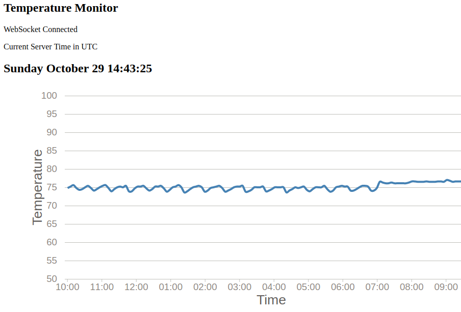

# Introduction

This is the documentation for a project based on the Mongoose-OS operating system.
The development board contains an ESP32 system-on-chip.  A DHT22 temperature-humidity sensor chip is wired
to the ESP32 board.

The system is an HTTP5 web server.  The server provides a web page which then connects to the server via Websocket.
The browser must be Websocket capable.  After a Websocket connection is established, the server begins publishing
JSON data.  The data is received by the web page via embedded Javascript code.  D3.js visualization is used
to plot the incoming temperature data versus time.  An example plot is shown below.

A note of caution on this project.  None of the available security features are enabled.  This project should
only be deployed in a local network behind a firewall.  It should not be "internet facing".

Assembly of the project can be done on an inexpensive breadboard.  Most of the ESP32 development boards should work,
however, some of them have wide pin-spacings which do not work well with the common breadboard.  The latest board
from Adafruit, the "Feather" board is the narrowest seen yet, allowing two rows of pins on one side and one side
on the other.  This board also had capability for battery power which is a nice feature.

(insert Adafruit board/project image here)

